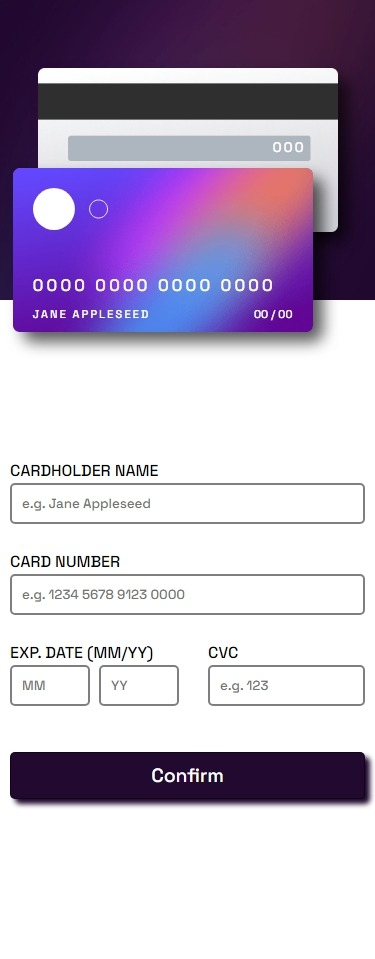

# Frontend Mentor - Interactive card details form solution

This is a solution to the [Interactive card details form challenge on Frontend Mentor](https://www.frontendmentor.io/challenges/interactive-card-details-form-XpS8cKZDWw). Frontend Mentor challenges help you improve your coding skills by building realistic projects. 

## Table of contents

- [Overview](#overview)
  - [The challenge](#the-challenge)
  - [Screenshot](#screenshot)
  - [Links](#links)
- [My process](#my-process)
  - [Built with](#built-with)
  - [What I learned](#what-i-learned)
  - [Continued development](#continued-development)
- [Author](#author)

## Overview

### The challenge

Users should be able to:

- Fill in the form and see the card details update in real-time
- Receive error messages when the form is submitted if:
  - Any input field is empty
  - The card number, expiry date, or CVC fields are in the wrong format
- View the optimal layout depending on their device's screen size
- See hover, active, and focus states for interactive elements on the page

### Screenshot




### Links

- Solution URL: [Solution URL](https://github.com/RibamarRodrigues/CardProject-By-FrontMentor)
- Live Site URL: [Live Site](https://ribamarrodrigues.github.io/CardProject-By-FrontMentor/)

## My process

### Built with

- Semantic HTML5 markup
- CSS custom properties
- Flexbox
- CSS Grid
- Desktop-first workflow
- RegEx

### What I learned

I was able to learn to better use the validation methods of a form

```js
let cardName = event.target

if (cardName.validity.valid == false) {
        cardName.style.border = "2px solid hsl(0, 100%, 66%)"
        errorName.style.opacity = "1"
    } else {
        cardName.style.border = "2px solid hsl(278, 68%, 11%)"
        errorName.style.opacity = "0"
    }
```


### Continued development

I intend to learn more about RegEx and much more about Js, as I started to learn recentlyt.

## Author

- GitHub - [Ribamar](https://github.com/RibamarRodrigues)
- Frontend Mentor - [@RibamarRodrigues](https://www.frontendmentor.io/profile/RibamarRodrigues)
